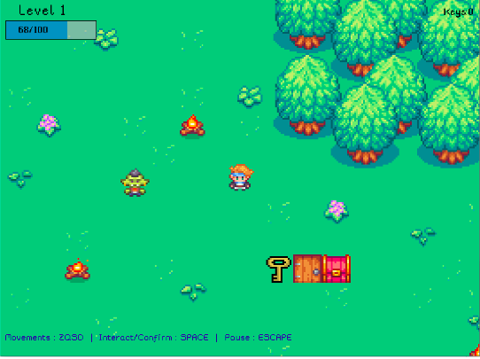
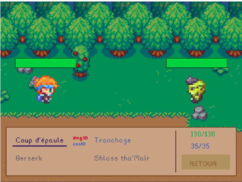

# Projet Objet

## ✨ Contributeurs ✨

<!-- prettier-ignore-start -->
<!-- markdownlint-disable -->

<table align="center">
    <tbody>
        <tr>
            <td width="25%" align="center" valign="top">
                <a href="https://github.com/Agheroo">
                     <br/>
                    <b>Renan REAUX</b>
                </a> <br/>
            </td>
            <td width="25%" align="center" valign="top">
                <a href="https://github.com/defidelamort">
                     <br/>
                    <b>Akim ZOUAOUI</b>
                </a> <br/>
            </td>
            <td width="25%" align="center" valign="top">
                <a href="https://github.com/Azrod64">
                     <br/>
                    <b>Romuald MOISAN</b>
                </a> <br/>
            </td>
        </tr>
    </tbody>
</table>

<!-- markdownlint-restore -->
<!-- prettier-ignore-end -->

All commits are available [here](https://github.com/Agheroo/projet-java-poo/commits/main/).

## 🎮 Le jeu 🎮

Le jeu "Donjon et Dragon" est une application Java basée sur des classes orientées objet. 
Il propose une expérience de jeu immersive dans laquelle les joueurs peuvent explorer des donjons, combattre des ennemis, interagir avec des éléments de l'environnement et progresser dans un monde fantastique. 
Les choix du joueur vont être décisif dans son exploration, notamment de la classe qu'il va choisir.
Le gameplay se concentre sur l'exploration, le combat stratégique et la progression du personnage à travers différents niveaux du donjon.

### Game screenshots

<p align="center">
    
</p>
<p align="center">
    
</p>


### Controles

|     Action     |  Touches   |
|:--------------:|:----------:|
| Aller en Haut  |   **Z**    |
|  Aller en Bas  |   **S**    |
| Aller à Gauche |   **Q**    |
| Aller à Droite |   **D**    |
|   Intéragir    | **Espace** |
| Stopper le jeu | **Echap**  |

## 💻 Compiler et lancer le projet 💻

Veuillez au préalable cloner le projet sur votre mahcine :
```shell
git clone https://github.com/Agheroo/projet-java-poo
cd projet-java-poo
```

### Commandes

**Windows users**

 - Veuillez avoir installé Java sur votre machine
 - Veuillez vous rendre sous le dossier projet-java-poo/out/artifacts/projet_java_poo_jar.
 - Double cliquez sur projet-java-poo.jar pour lancer le jeu.

**Unix users**

```shell
cd projet-java-poo/out/artifacts/projet_java_poo_jar
java -jar projet-java-poo.jar
```


